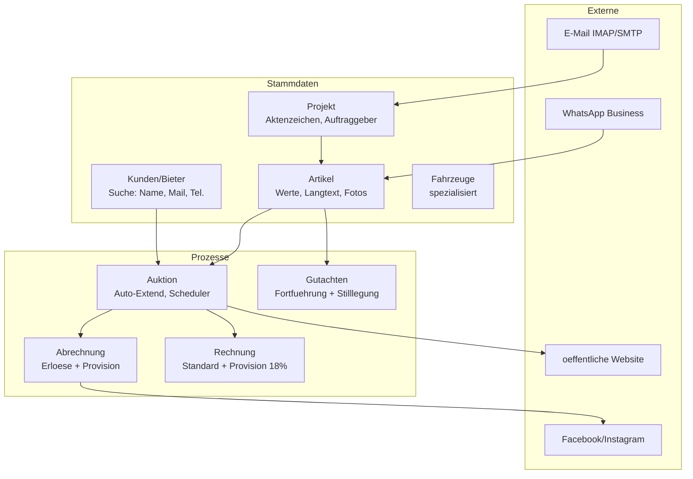
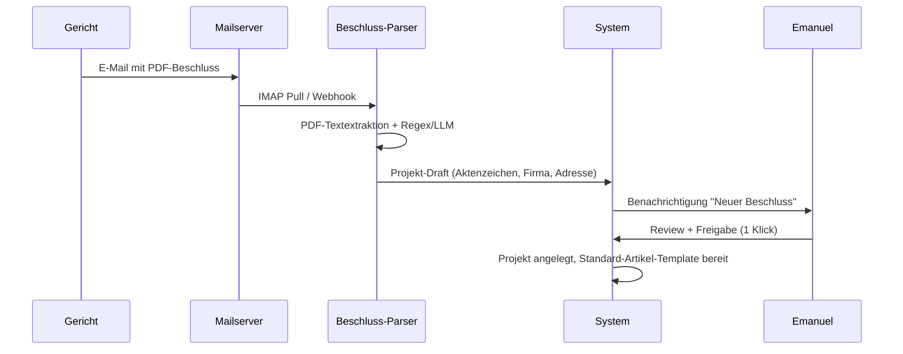
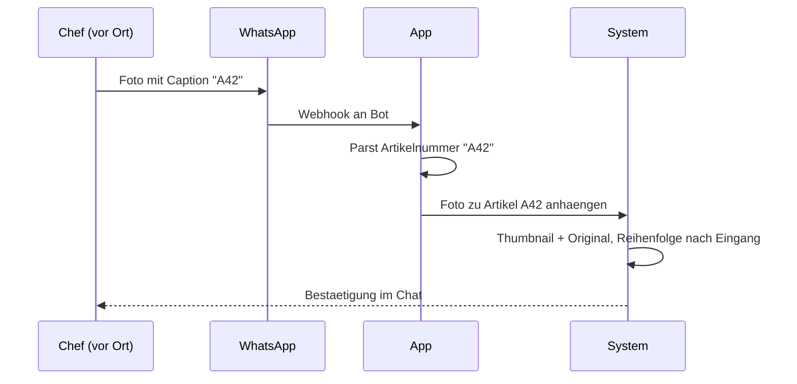
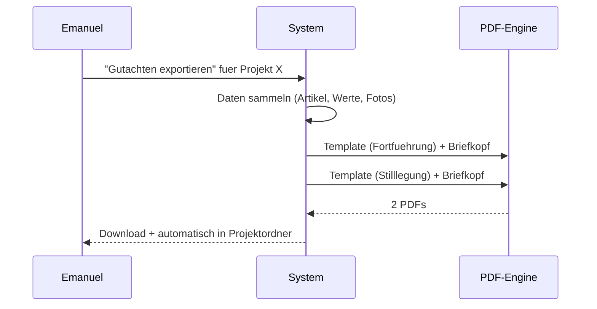

# Prozess-Roadmap — Ziegler Treuhand Auktions-Tool

Ziel: Ablösung der 20–25 Jahre alten Webapplikation und Automatisierung des gesamten Workflows vom Gerichtsbeschluss bis zur Abrechnung.

---

## 1. Überblick — Ist-Zustand

```mermaid
flowchart LR
    A[E-Mail mit Beschluss] -->|manuell abtippen| B[Projekt anlegen]
    B -->|manuell| C[Artikelstamm füllen<br/>Werte, Langtext, Steuer]
    C -->|manuell| D[Fotos per WhatsApp<br/>Upload, Sortierung chaotisch]
    D -->|manuell| E[Auktion anlegen<br/>Zeiten versetzt eintragen]
    E --> F[Auktion laeuft<br/>Anzeige aktualisiert nicht]
    F --> G[Gutachten in Word<br/>Fortfuehrung + Stilllegung]
    G --> H[Abrechnung + Rechnung<br/>manuell in Word]
    H --> I[Versand per Mail<br/>Gmail-Empfaenger erhalten nichts]
    I --> J[Social Media<br/>manuelles Posten]

    style A fill:#ffe0e0
    style D fill:#ffe0e0
    style G fill:#ffe0e0
    style H fill:#ffe0e0
    style I fill:#ffe0e0
```

**Rot markiert:** Hauptzeitfresser laut Interview mit Emanuel Aydin.

---

## 2. Soll-Zustand

```mermaid
flowchart LR
    A[E-Mail mit Beschluss] -->|Parser + OCR| B[Projekt automatisch angelegt<br/>Aktenzeichen, Firma, Adresse]
    B -->|Templates + KI| C[Artikelstamm vorbefuellt<br/>Werte nach Regeln, Langtext-Vorschlag]
    C -->|Mobile App + WhatsApp-Bot| D[Fotos getaggt, sortiert<br/>Drag-and-Drop Reihenfolge]
    D -->|Auto-Scheduler| E[Auktion generiert<br/>versetzte Endzeiten automatisch]
    E --> F[Live-Auktion<br/>Push-Update, Auto-Extend]
    F --> G[Gutachten-PDF<br/>1-Klick Export mit Briefkopf]
    G --> H[Rechnung + Abrechnung<br/>aus Vorlagen, SMTP + PDF]
    H --> I[Zustellung gemonitort<br/>Bounce-Handling fuer Gmail]
    I --> J[Social Posting<br/>Meta Graph API]

    style A fill:#e0ffe0
    style B fill:#e0ffe0
    style C fill:#e0ffe0
    style D fill:#e0ffe0
    style E fill:#e0ffe0
    style F fill:#e0ffe0
    style G fill:#e0ffe0
    style H fill:#e0ffe0
    style I fill:#e0ffe0
    style J fill:#e0ffe0
```

---

## 3. Kern-Domänen

---

## 4. Priorisierte Phasen

| Phase | Fokus | Business-Value | Aufwand |
|-------|-------|----------------|---------|
| **P1 — Fundament** | Projekt-/Artikel-/Kunden-Domain, Auth, DB, Stamm-UI | Ersetzt Altsystem-Basis | 4–6 Wochen |
| **P2 — Dokumenten-KI** | Beschluss-Parser, Fahrzeugschein-OCR, Artikellisten-Import (Scan/handschriftlich) | Spart täglich Abtipp-Zeit | 3–4 Wochen |
| **P3 — Gutachten & Dokumente** | Briefkopf digitalisieren, Gutachten-PDF, Abrechnungs-PDF, Rechnungs-PDF | Entfernt Word-Prozess | 3 Wochen |
| **P4 — Auktions-Engine** | Scheduler, Auto-Extend (2min < 500€, 1min > 500€), Live-Update | Kundenerlebnis + Rechtssicherheit | 4 Wochen |
| **P5 — Foto-Workflow** | Upload, Drag-&-Drop-Sortierung, WhatsApp-Bot, Mobile | Löst größtes UX-Problem | 2–3 Wochen |
| **P6 — Kundenportal** | Registrierung, Passwort-Reset via Mail/Tel., Rechnungsarchiv | Beseitigt Support-Aufwand | 2 Wochen |
| **P7 — Zustellung & Bounce** | SPF/DKIM/DMARC, Bounce-Monitoring, Gmail-Fallback (API) | Verhindert Nachversand | 1–2 Wochen |
| **P8 — Social & Reporting** | Meta Graph API, Auswertungen nach Bezeichnung/Fortführung | Marketing + Geschäftsführung | 2 Wochen |

**Gesamt:** ~22–28 Wochen für Vollablösung, aber bereits nach P1+P2 spürbare Entlastung.

---

## 5. Haupt-Userflows

### 5.1 Neues Projekt aus Beschluss

### 5.2 Artikel mit Fotos erfassen

### 5.3 Gutachten-Export

---

## 6. Quick Wins (erste 4 Wochen)

1. **Beschluss-E-Mail-Parser** — größter Zeitfresser, klar strukturierte Quelle.
2. **Fahrzeugschein-OCR** — Fahrzeuge sind Umsatzträger.
3. **Foto-Sortier-UI** — niedrige Komplexität, hoher UX-Gewinn.
4. **PDF-Briefkopf + erstes Gutachten-Template** — löst sofort den Word-Zwang.

---

## 7. Erfolgs-Metriken

- Zeit von E-Mail-Eingang bis fertiges Projekt: **< 5 Min** (statt Stunden).
- Manuelle Abtipp-Zeit pro Artikelliste (250 Artikel): **< 10 Min** (statt halber Tag).
- Gutachten-Erstellung pro Projekt: **< 2 Min** (statt Stunden in Word).
- Zustellrate Pro-Forma-Rechnung: **> 99 %** (inkl. Gmail).
- Auktionszeiten-Anzeige: **Echtzeit** (statt Browser-Refresh nötig).
