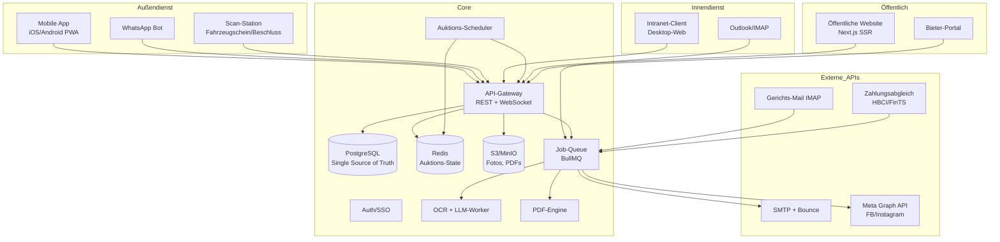
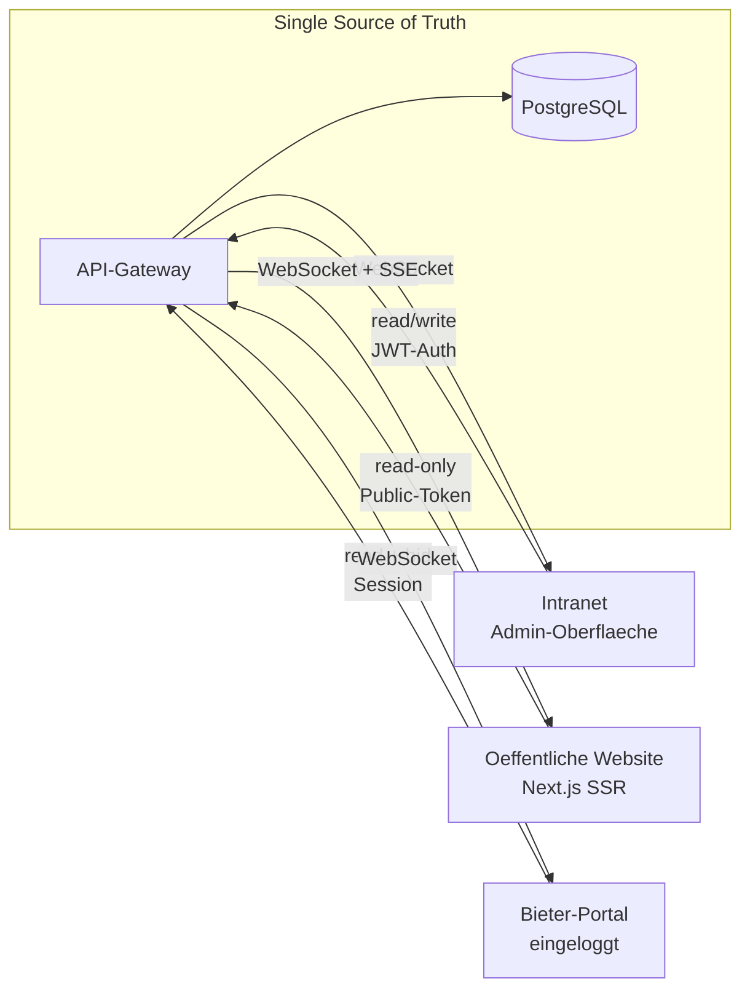
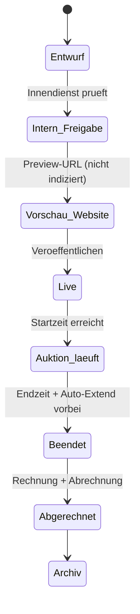
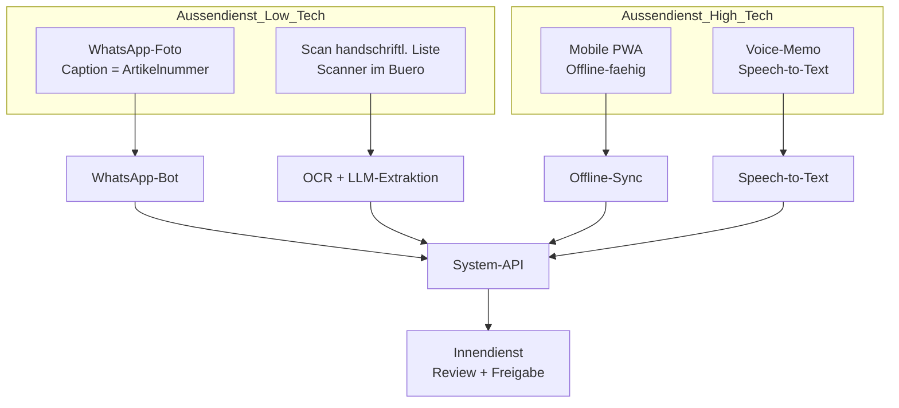
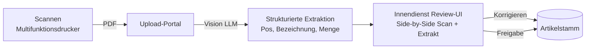
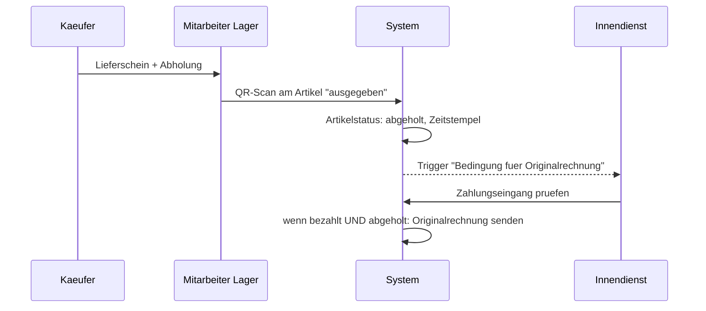

# Architektur, Integrationen & Sync

Dieses Dokument beantwortet drei Fragen:

1. **Welche externen Anbindungen werden gebraucht?**
2. **Wie schaltet man Intranet (interne Software) und Website (öffentliche Auktionsplattform) gleich?**
3. **Wie verbindet man Außendienst (vor Ort beim Kunden) und Innendienst (Büro) optimal?**

---

## 1. System-Topologie

---

## 2. Externe Anbindungen — Checkliste

| # | Anbindung | Zweck | Technologie | Priorität |
|---|-----------|-------|-------------|-----------|
| 1 | **IMAP (Gerichts-Postfach)** | Beschluss-E-Mails automatisch einlesen | `node-imap` + S/MIME-Support | P1 |
| 2 | **SMTP (transaktional)** | Rechnungen, Abrechnungen, Auktionsbestätigungen | Postmark / Mailgun / SES | P1 |
| 3 | **Bounce-/DSN-Monitoring** | Gmail-Zustellprobleme früh erkennen | Provider-Webhook | P2 |
| 4 | **SPF / DKIM / DMARC** | Zustellbarkeit sicherstellen | DNS-Konfiguration | P1 |
| 5 | **OCR-Engine** | Fahrzeugscheine, gescannte Artikellisten | Tesseract + Azure Document Intelligence / AWS Textract | P1 |
| 6 | **LLM** | Strukturierung freier Texte (handschriftliche Listen), Langtext-Vorschläge | Claude API (Anthropic) | P1 |
| 7 | **WhatsApp Business API** | Foto-Upload vom Chef direkt zu Artikel | Meta Cloud API oder 360dialog | P2 |
| 8 | **Meta Graph API** | Auktions-Postings auf Facebook + Instagram | Meta Graph API | P4 |
| 9 | **Fahrzeug-Datenbank** | Plausibilitätscheck Fabrikat/Typ aus Fahrzeugschein | KBA-SV / Schwacke (optional) | P3 |
| 10 | **Zahlungseingang (Bank)** | Automatischer Abgleich für Originalrechnungs-Versand | HBCI/FinTS via `FinTS-PHP` / `fints-hbci-php` oder Bank-API | P3 |
| 11 | **PDF-Signatur** | Qualifizierte E-Signatur auf Gutachten (optional) | DocuSign / Bundesdruckerei | P4 |
| 12 | **Objektspeicher** | Fotos, PDF-Archiv | S3 / MinIO (self-hosted) | P1 |
| 13 | **Push-Benachrichtigungen** | Mobile App bei neuen Geboten / Beschlüssen | FCM + APNs | P2 |
| 14 | **Kalender** | Abholtermine synchronisieren | CalDAV / Google Calendar / Microsoft 365 | P3 |
| 15 | **Website-SSR** | SEO + Live-Anzeige | Next.js + ISR/SSR, Public-API | P1 |
| 16 | **Analytics / SEO** | Indexierung sicherstellen (ersetzt die „dreifach-eintragen"-Praxis) | Strukturiertes `schema.org/Product` + Sitemap | P2 |

---

## 3. Intranet ↔ Website — wie gleichgeschaltet?

### 3.1 Prinzip: **Ein System, zwei Oberflächen**

**Kein zweiter Datentopf**, keine Synchronisations-Jobs — Website und Intranet greifen auf dieselbe Datenbank über dieselbe API zu. Das ist der größte Gewinn gegenüber dem Altsystem und eliminiert sofort die „falsche Zeiten / keine Aktualisierung"-Probleme.

### 3.2 Echtzeit-Fluss für Auktionen

| Ereignis | Propagation | Technik |
|----------|-------------|---------|
| Neues Gebot | Push an alle verbundenen Bieter in < 500 ms | Redis Pub/Sub → WebSocket |
| Auktionszeit-Verlängerung (Auto-Extend-Regel) | Atomar in DB + Broadcast | DB-Transaktion, dann Event |
| Countdown-Tick | Clientseitig aus Server-Endzeit berechnet | Server liefert `end_ts`, Client rechnet lokal; alle 30 s Resync |
| Artikel veröffentlichen | Publish-Event → ISR-Revalidate der Website | Next.js `revalidatePath()` |
| Foto-Reihenfolge ändern | PATCH → WebSocket-Broadcast | optimistic UI |

### 3.3 Veröffentlichungs-Workflow

- **Entwurf** ist nur im Intranet sichtbar.
- **Vorschau** wird über signierten Token freigegeben (kein Google-Index).
- **Live** erscheint auf der öffentlichen Website — Content wird via ISR neu generiert.

### 3.4 SEO / strukturierte Daten

Statt dieselbe Info in drei Felder zu kopieren: **strukturierte `schema.org/Product` + `Offer`-Markups** automatisch aus dem Artikelstamm generieren. Damit indexiert Google zuverlässig die „oberste Zeile" ohne Dubletten.

---

## 4. Außendienst ↔ Innendienst — Verbindung

### 4.1 Rollen und Kanäle

| Rolle | Typischer Ort | Haupt-Device | Primärer Kanal |
|-------|---------------|--------------|----------------|
| Chef (68) | Bei Schuldnern vor Ort | Smartphone-Kamera + Stift/Papier | **WhatsApp + Scan** |
| Emanuel (Innendienst) | Büro | Desktop | **Intranet-Web** |
| Mitarbeiter Abholung | Lager | Smartphone | **Mobile App (Lieferschein-Scan)** |
| Gutachter | Bei Schuldnern | Tablet | **Mobile App (PWA)** |

### 4.2 Hybrides Vorgehen — akzeptiert die Realität

Da ein 68-jähriger Kollege keine App nutzt, braucht es **zwei Wege**, die zum selben Ergebnis führen:

### 4.3 Mobile-PWA-Anforderungen (für jüngere Mitarbeiter / Gutachter)

- **Offline-first:** IndexedDB-Queue; Synchronisation sobald Netz wieder da ist.
- **Kamera direkt an Artikel:** Bild wird inkl. GPS + Zeitstempel dem Artikel angehängt.
- **Fahrzeugschein-Scan:** Kamera-Overlay erkennt Dokument, OCR läuft in der Cloud.
- **Barcode-/QR-Scanner:** Eigenes Artikel-Label-System (z. B. QR-Sticker am Objekt).
- **Voice-Memo:** Für Langtexte — wird vom LLM in strukturierten Artikeltext verwandelt.
- **Checkliste vor Ort:** Was noch fehlt (Foto von vorn, Foto vom Typenschild, Kilometerstand).

### 4.4 WhatsApp-Bot (Pfad für den Chef)

Flow:

1. Chef schickt Foto mit Caption `A42` oder `Projekt 2024-119 / Pos 3`.
2. Bot antwortet sofort: „✅ Foto zu Artikel A42 (Projekt XY) gespeichert. Aktuell 4 Fotos."
3. Bot erlaubt Commands: `liste` (offene Projekte), `neu <firma>` (Projekt anlegen), `ende` (Projekt abschließen).
4. **Fallback:** Wenn Caption fehlt, antwortet der Bot mit Liste der offenen Projekte → Chef tippt Zahl.

Vorteil: Chef braucht **keine neue App**, WhatsApp kennt er schon.

### 4.5 Handschriftliche Listen digitalisieren

Da Artikellisten mit bis zu 250 Positionen handschriftlich kommen, ist das der größte Engpass.

**Key:** Side-by-Side-Review — links Scan, rechts extrahierte Zeilen mit Inline-Edit. Das ersetzt stundenlanges Abtippen durch 10 Minuten Korrekturlesen.

### 4.6 Abhol-Workflow (Lager ↔ Büro)

### 4.7 Synchronisations-Muster

| Muster | Wofür | Warum |
|--------|-------|-------|
| **Single Source of Truth** (Server-DB) | Alle Stammdaten | Vermeidet Konflikte |
| **Optimistic UI + Conflict-Resolution** | Mobile Edits | Außendienst tippt auch offline |
| **Event-Sourcing für Auktionen** | Gebote, Verlängerungen | Vollständiger Audit-Trail, Rechtssicherheit |
| **CRDT für Foto-Reihenfolge** | Parallele Umsortierung | Zwei Personen sortieren gleichzeitig ohne Kollision |
| **Webhooks** | WhatsApp, Bounce, Meta | Push statt Polling |

---

## 5. Zusammenfassung — was das Tool braucht

**Pflicht (MVP):**
- IMAP + SMTP (für Beschluss-Eingang und Rechnungs-Ausgang)
- PostgreSQL + Redis + S3/MinIO
- OCR + LLM (Claude) für Dokumenten-Extraktion
- WebSocket/SSE für Echtzeit
- Meta Graph API für Social Posts
- PWA für Außendienst
- WhatsApp Business API als Low-Tech-Pfad

**Kür (Phase 2+):**
- HBCI-Bank-Anbindung für Zahlungsabgleich
- KBA/Schwacke für Fahrzeugdaten
- DocuSign für qualifizierte Signatur
- Kalender-Sync für Abholtermine
