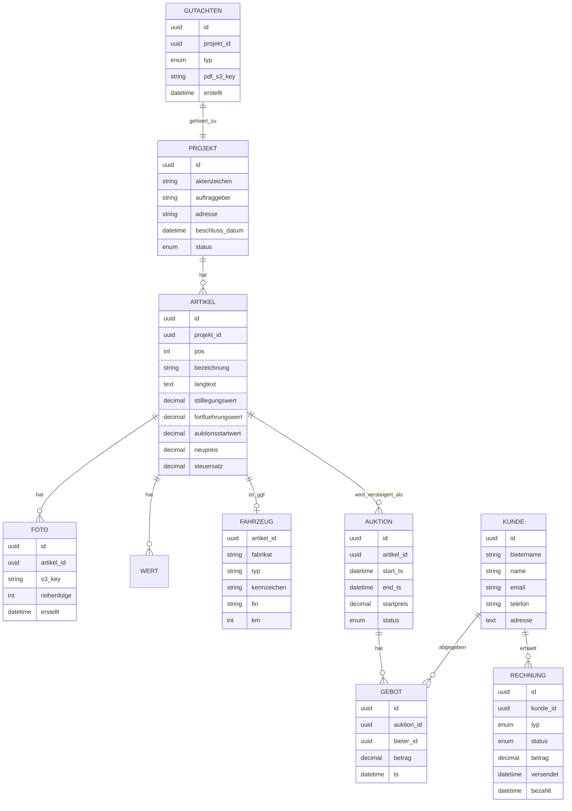

# Coding-Plan — Umsetzung

---

## 1. Technologie-Stack (Empfehlung)

| Schicht | Wahl | Begründung |
|---------|------|------------|
| **Frontend Intranet** | Next.js 15 (App Router) + TypeScript + React Server Components | SSR, Streaming, gleiche Codebasis wie Website |
| **Öffentliche Website** | Next.js 15 + ISR | SEO, Live-Auktionsdaten via WebSocket |
| **Mobile Außendienst** | PWA (Next.js) + Capacitor-Wrapper | Ein Code für iOS + Android, offline-fähig |
| **UI-Kit** | shadcn/ui + TailwindCSS + `@tanstack/react-query` + `zustand` | Produktiv, erprobt |
| **Backend API** | Node.js + Fastify + TypeScript + `zod` | Performant, typsicher, passt zum FE-Stack |
| **ORM** | Drizzle oder Prisma | Typsicher, Migrations |
| **DB** | PostgreSQL 16 | Relational, volltext, `tsvector` für Suche |
| **Cache / Pub-Sub** | Redis | Auktions-State, WebSocket-Broadcast |
| **Queue** | BullMQ (Redis) | Robust, Retries, Delayed Jobs |
| **Objekt-Speicher** | MinIO (self-hosted) oder S3 | Fotos, PDFs |
| **Echtzeit** | WebSocket über Fastify + `socket.io` oder native `ws` | Gebote, Countdown, Reihenfolge |
| **PDF-Generierung** | Puppeteer + HTML-Templates (React + Tailwind) | Pixel-perfekte Gutachten mit Briefkopf |
| **OCR** | Azure Document Intelligence (Fahrzeugschein-Preset) + Tesseract-Fallback | Höchste Genauigkeit für DE-Dokumente |
| **LLM** | Claude API (Anthropic) `claude-sonnet-4-6` für Extraktion, `claude-opus-4-7` für komplexe Gutachten-Textgenerierung | State of the Art, strukturierte Outputs per Tools |
| **Mail-Versand** | Postmark (transaktional) | Beste Zustellraten bei Gmail |
| **Mail-Empfang** | `imapflow` + Worker | Gerichts-Mail-Postfach lesen |
| **Auth** | `better-auth` oder NextAuth + TOTP | Einfach, passwort + 2FA |
| **Test** | Vitest + Playwright | Unit + E2E |
| **Deploy** | Docker Compose initial → K8s später, Caddy als Reverse Proxy | Low-Ops, self-hosted möglich |

---

## 2. Monorepo-Struktur

```
shopify-builder/              # Repo-Name bleibt technisch, fachlich: "ziegler-auktion"
├── apps/
│   ├── intranet/             # Next.js, Innendienst-UI
│   ├── website/              # Next.js, öffentliche Auktionsplattform
│   ├── api/                  # Fastify, REST + WS
│   └── mobile/               # PWA für Außendienst (kann auch Teil von intranet/website sein)
├── packages/
│   ├── db/                   # Drizzle Schema + Migrations
│   ├── shared/               # Zod-Schemas, Types, Utility
│   ├── ui/                   # shadcn-Komponenten
│   ├── pdf/                  # Gutachten-/Rechnungs-/Abrechnungs-Templates
│   ├── ocr/                  # OCR-/LLM-Wrapper
│   ├── auction-engine/       # Auto-Extend, Scheduler, Gebots-Logik
│   ├── mail/                 # IMAP-Pull, SMTP-Push, Bounce-Handling
│   ├── whatsapp/             # Bot für Foto-Upload
│   └── social/               # Meta Graph API
├── workers/
│   ├── beschluss-parser/
│   ├── ocr-worker/
│   ├── pdf-worker/
│   ├── mail-bounce-watcher/
│   └── auction-scheduler/
├── infra/
│   ├── docker-compose.yml
│   └── caddy/
├── docs/                     # Diese Dokumente
└── turbo.json                # Turborepo
```

---

## 3. Datenmodell (Kern-Entitäten)



Indizes kritisch für Suche:
- `KUNDE (email, telefon, name)` mit trigram/`pg_trgm` für Fuzzy-Matching.
- `ARTIKEL (bezeichnung) tsvector` für Volltext.

---

## 4. Kritische Business-Logik

### 4.1 Auto-Extend

```ts
// packages/auction-engine/src/autoExtend.ts
export function computeNewEndTs(
  currentEnd: Date,
  bidAmount: number,
  bidTime: Date,
): Date {
  const remainingMs = currentEnd.getTime() - bidTime.getTime();
  // Nur verlängern, wenn Gebot in letzten 2 Min kommt
  if (remainingMs > 2 * 60_000) return currentEnd;

  const extensionMin = bidAmount < 500 ? 2 : 1;
  const minNewEnd = new Date(bidTime.getTime() + extensionMin * 60_000);
  return minNewEnd > currentEnd ? minNewEnd : currentEnd;
}
```

Muss **atomar in DB-Transaktion** ablaufen: `SELECT FOR UPDATE` auf Auktion → Gebot einfügen → Endzeit-Update → Event publish.

### 4.2 Versetzte Auktions-Endzeiten

```ts
// packages/auction-engine/src/scheduler.ts
export function schedule(artikel: Artikel[], startzeit: Date, intervallSek = 30): Auktion[] {
  return artikel.map((a, i) => ({
    artikel_id: a.id,
    start_ts: startzeit,
    end_ts: new Date(startzeit.getTime() + (i + 1) * intervallSek * 1000 + 7 * 24 * 3600 * 1000),
    startpreis: a.auktionsstartwert,
  }));
}
```

### 4.3 Beschluss-Parser (LLM + Regex)

```ts
// workers/beschluss-parser/src/extract.ts
const extractTool = {
  name: "extract_beschluss",
  input_schema: z.object({
    aktenzeichen: z.string(),
    auftraggeber_firma: z.string(),
    auftraggeber_adresse: z.string(),
    schuldner_firma: z.string(),
    schuldner_adresse: z.string(),
    beschluss_datum: z.string().describe("ISO-8601"),
    gericht: z.string(),
  }),
};
// Claude API mit Tool-Use auf PDF-Text → strukturiertes Ergebnis
```

Mit Prompt-Caching den Beschluss-Stil cachen (zählt sich schnell).

### 4.4 Fahrzeugschein-OCR

Azure Document Intelligence hat ein **fertiges Preset für deutsche Fahrzeugscheine**. Ausgabe direkt als JSON mit `fabrikat`, `typ`, `FIN`, `kennzeichen`, `erstzulassung`.

### 4.5 Handschriftliche Artikelliste → strukturiert

- Scan hochladen → Bild in 300 DPI.
- Claude Vision Call: „Extrahiere jede Zeile als `{pos, bezeichnung, menge}`. Gib Zeilen zurück, auch wenn unsicher — markiere `confidence: low`."
- Im Review-UI: linkes Panel = Scan (Zoom), rechtes Panel = Tabelle, Zeilen mit `confidence: low` rot hervorgehoben.

---

## 5. Implementierungs-Reihenfolge (Sprints)

### Sprint 0 (Woche 1)
- Monorepo + Tooling (Turbo, Docker Compose, CI)
- DB-Schema-Entwurf, Auth-Skeleton
- Health-Check-Deploy auf Ziel-Umgebung

### Sprint 1 (Woche 2–3) — Stammdaten
- Projekt, Artikel, Kunde CRUD im Intranet
- `pg_trgm`-Suche über Kunden (Name, Mail, Tel.)
- Foto-Upload (ohne Sortierung)

### Sprint 2 (Woche 4–5) — Dokumenten-Eingang
- IMAP-Worker (Gerichts-Postfach)
- Beschluss-Parser (Claude + Tool-Use)
- Review-UI „Neuer Beschluss" mit 1-Klick-Freigabe

### Sprint 3 (Woche 6–7) — Fahrzeuge & Listen
- Fahrzeugschein-OCR
- Handschriftliche Liste → Review-UI
- Artikel-Duplikation und Projekt-Klonen

### Sprint 4 (Woche 8–9) — PDF-Ausgabe
- Briefkopf-Digitalisierung (SVG + Template)
- Gutachten-Template (Fortführungs- und Stilllegungswert)
- Rechnungs- und Abrechnungs-Template
- PDF-Engine-Worker

### Sprint 5 (Woche 10–12) — Auktions-Engine
- Auktion anlegen, Scheduler, versetzte Endzeiten
- Auto-Extend-Logik mit Tests
- WebSocket-Broadcast für Gebote
- Öffentliche Website (Artikel-Listing, Detailseite)

### Sprint 6 (Woche 13–14) — Fotos & WhatsApp
- Drag-&-Drop-Sortierung (CRDT via `yjs` oder einfacher LWW)
- WhatsApp Business API Bot
- Mobile-PWA-Kamera-Upload

### Sprint 7 (Woche 15–16) — Kundenportal & Zustellung
- Bieter-Registrierung, Passwort-Reset via Mail **und** Telefon
- SPF/DKIM/DMARC, Postmark, Bounce-Handling
- Rechnungsarchiv im Kundenportal

### Sprint 8 (Woche 17–18) — Social & Reporting
- Meta Graph API (FB + Instagram)
- Auswertungen mit Filtern (Bezeichnung, Fortführung, Sicherungsrechte)
- Dashboard

### Sprint 9 (Woche 19–20) — Migration vom Altsystem
- Daten-Import-Skripte
- Parallelbetrieb + Abgleich
- Umschaltung

---

## 6. Risiken & Gegenmaßnahmen

| Risiko | Gegenmaßnahme |
|--------|---------------|
| LLM halluziniert beim Beschluss-Parsing | Tool-Use mit Zod-Validierung + menschliche Freigabe vor Projekt-Anlage |
| Auto-Extend-Race-Conditions | DB-Transaktion mit `SELECT FOR UPDATE`, Test-Suite mit parallelen Geboten |
| Gmail blockt weiterhin | Postmark + Return-Path + DMARC `p=quarantine` → `p=reject`; Fallback: Rechnung im Kundenportal abrufbar |
| 68-jähriger Chef will App nicht | WhatsApp-Pfad **und** Scan-Pfad sind Pflicht, nie nur App |
| Datenmigration aus 25-j. Altsystem | Read-only-Export via deren Excel-Export → ETL-Skripte → Dry-Run |
| Rechtliche Anforderungen an Versteigerung | Event-Sourcing jeder Gebotsabgabe, unveränderlicher Audit-Log |
| Performance bei 250 Artikeln mit je 10 Fotos | Thumbnail-Pipeline, CDN, Pagination, Virtual Scroll |

---

## 7. Sofort-Maßnahmen (erste Woche)

- [ ] Repo-Skelett anlegen (Turborepo, Next.js, Fastify, Drizzle)
- [ ] DB-Schema v1 (Projekt, Artikel, Kunde, Foto, Auktion, Gebot, Rechnung) + Migrations
- [ ] Docker-Compose für lokale Entwicklung (Postgres, Redis, MinIO)
- [ ] Beispiel-Gerichtsbeschluss anonymisiert besorgen und als Test-Fixture ablegen
- [ ] Beispiel-Fahrzeugschein für OCR-Test
- [ ] Briefkopf-SVG vom Unternehmen einholen
- [ ] Claude API Key + Postmark Account + Meta Dev Account einrichten

---

## 8. Offene Fragen für Ziegler Treuhand

1. Welches Altsystem konkret? Export-Möglichkeit in Excel/CSV?
2. Welches Mail-Postfach empfängt Gerichtsbeschlüsse (IMAP-Zugang möglich)?
3. Rechtliche Anforderungen (Versteigerungsverordnung, Archivierungspflicht — 10 Jahre?)
4. Hosting-Präferenz: Cloud (AWS/Hetzner) oder eigener Server?
5. Wer pflegt Vorlagen (Briefkopf, Gutachten-Wording) — Freigabe nötig?
6. Volumen: Projekte/Monat, Artikel/Projekt, Bieter/Auktion? (für Kapazitätsplanung)
7. Existiert schon eine Domain-Struktur (auktion.ziegler-treuhand.de)?
