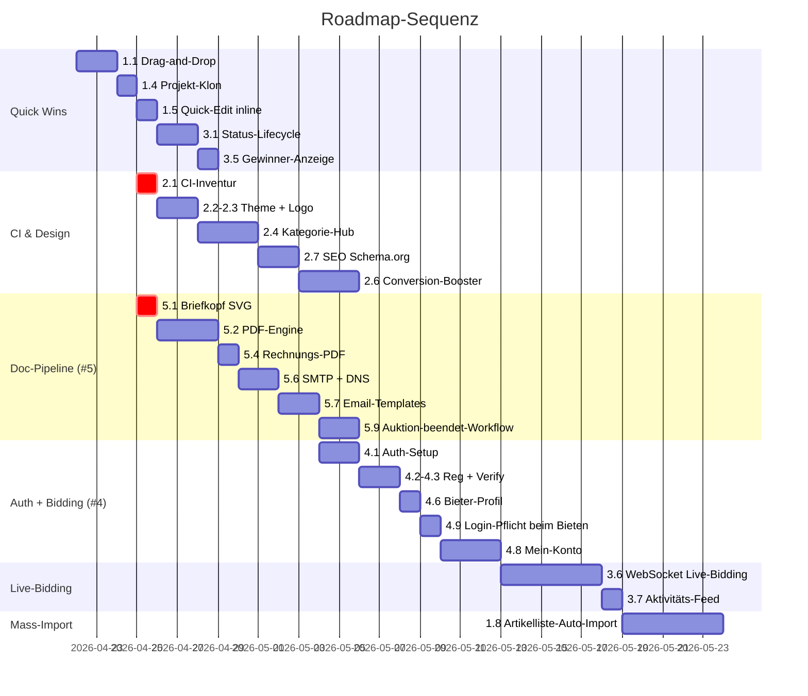

# Roadmap — Fortsetzung (Sprint 5+)

Status der Plattform nach Sprint 1–4 (alles bereits gepusht):

- ✅ Beschluss-Parser via Claude API + Review-UI
- ✅ Fahrzeugschein-Parser (Vision) + Artikel-Anlage
- ✅ Foto-Eingang mit Schild-Nummer-Erkennung + Auto-Match
- ✅ Strukturierte Foto-Ablage `uploads/fotos/projekt-X/artikel-Y/`
- ✅ Öffentliche Website `/versteigerung` mit Hero, Grid, Detail, Live-Bidding
- ✅ Idempotenter Seed mit IVECO-LKW + Pfannen + Sitzbänken

Es folgen die nächsten 5 Stränge — nach **Wirkung × Aufwand** priorisiert.

---

## 1 · Intranet-Automation & UX

**Ziel:** Innendienst soll von Klick-Marathon zu „Drag, prüfen, freigeben" kommen.

| # | Feature | Beschreibung | Aufwand |
|---|---------|-------------|---------|
| 1.1 | **Drag-and-Drop überall** | Globale Drop-Zone auf Projekt-Detail / Foto-Eingang / Dokumenten-Seite. Auto-Erkennung des Datei-Typs (PDF=Beschluss/Gutachten, JPG mit Schild=Foto-Eingang, JPG=Artikel-Foto). | M (1 Tag) |
| 1.2 | **Beschluss → 1-Klick „Projekt + Standard-Auktion + Bieter-Pool"** | Nach Freigabe des Beschlusses: Auswahl-Dialog „Wie geht's weiter?" → Optionen: a) nur Projekt, b) Projekt + leerer Artikelstamm vorbereitet, c) Projekt + Vorlage-Auktionen aus letztem Vergleichbaren | M |
| 1.3 | **Bulk-Aktionen** | Mehrere Artikel anhaken → „Alle in Auktion", „Werte ×1.1", „Standort setzen", „Löschen". Mehrere Fotos im Eingang anhaken → „Allen Pos 28 zuweisen" | M |
| 1.4 | **Projekt-/Artikel-Klon** | Wiederkehrende Artikel-Sets (z.B. Standard-Werkzeug-Posten, der wöchentlich kommt) in 1 Klick duplizieren. Aus Interview: explizit gewünscht. | S (½ Tag) |
| 1.5 | **Quick-Edit inline** | Werte direkt in Tabelle ändern (Doppelklick → editierbar) statt Detailseite öffnen | S |
| 1.6 | **Tastenkürzel** | `n` neuer Artikel, `e` Edit, `f` Foto-Upload, `Cmd+K` global search/jump | S |
| 1.7 | **Artikel-Vorlagen-Bibliothek** | Häufige Artikel-Typen (z.B. „Knupp HM 600", „Hyundai Bagger") als Templates speichern und wiederverwenden | M |
| 1.8 | **Handschriftliche Artikelliste auto-importieren** | Scan einer 250-Zeilen-Liste → Claude Vision erstellt Artikel in einem Rutsch + Review-UI Side-by-Side | L (2–3 Tage) |

**Quick-Win-Reihenfolge:** 1.1 → 1.4 → 1.5 → 1.3 → 1.8 → 1.2 → 1.7 → 1.6

---

## 2 · Website-Design v2 (CI-Anpassung an ziegler-treuhand.de)

**Ziel:** Nicht „modernes Design um des Designs willen", sondern Branding-konsistent + conversion-optimiert.

| # | Feature | Beschreibung | Aufwand |
|---|---------|-------------|---------|
| 2.1 | **CI-Inventur** | Screenshots + Style-Guide-Export von ziegler-treuhand.de: Logo (SVG), Primärfarbe, Sekundärfarbe, Akzent, Schriftart, Button-Form, Logo-Placement | S (1–2 h, blockiert von Logo/Farbcodes) |
| 2.2 | **Theme-Tokens neu mappen** | Tailwind-Theme an die echten Ziegler-Werte anpassen (statt aktuell Anthrazit + Goldenrod) | S |
| 2.3 | **Logo-Asset einbinden** | SVG/PNG-Logo statt Schrift-Wordmark | S |
| 2.4 | **Kategorie-Hub als Hauptanker** | Statt einer flachen Auktions-Liste: Kategorien-Übersicht (Fahrzeuge, Maschinen, Gastro, Immobilien, Sonstiges) jeweils mit Hero-Bild und Auktions-Counter — wie bei Christie's | M |
| 2.5 | **Sub-Kategorien** | Innerhalb „Fahrzeuge": LKW, PKW, Anhänger, Baumaschinen | S |
| 2.6 | **Conversion-Booster** | Live-Aktivität-Banner („7 Bieter aktiv auf Pos 7022"), Vertrauens-Siegel (IHK, Sachverständigen-Stempel), Bieter-Testimonials, „14 Tage erfolgreich abgeschlossen" | M |
| 2.7 | **SEO-Setup** | `schema.org/Product` + `Offer`-Markup pro Auktion, sitemap.xml, OG-Tags pro Detailseite (löst das „dreifach-eintragen"-Hack-Problem aus dem Interview) | M |
| 2.8 | **Filter-Sidebar** | Filter nach Standort, Preisbereich, Endzeit, Zustand, „nur Fahrzeuge mit TÜV" | M |
| 2.9 | **Watchlist & Benachrichtigung** | Stern-Icon → „Beobachten" → Email/Push wenn Endzeit nähert oder neues Gebot | M |
| 2.10 | **Suche mit Auto-Complete** | Volltext + Tags, Live-Vorschläge | M |

**Prerequisite:** 2.1 (CI-Daten von dir besorgen) — bevor 2.2/2.3 sinnvoll sind. Bitte schick mir Logo-SVG, Primär-Hex, sekundär-Hex und ggf. Schriftart-Name aus eurem Style-Guide.

---

## 3 · Intranet ↔ Website Kopplung

**Ziel:** Innendienst arbeitet, Website ist sofort live aktuell. Beendete Auktionen erscheinen mit Gewinner-Anzeige.

| # | Feature | Beschreibung | Aufwand |
|---|---------|-------------|---------|
| 3.1 | **Status-Lifecycle erweitert** | Artikel/Auktion: `entwurf → vorschau → live → laeuft → beendet → abgerechnet → archiv`. Nur `live`/`laeuft` erscheint öffentlich, `beendet` mit Gewinner-Status, alles davor versteckt | S |
| 3.2 | **Vorschau-URL** | Innendienst kann Entwurf via signiertem Link teilen (`?preview=tokenXYZ`), nicht-indiziert | S |
| 3.3 | **Veröffentlichen-Button** | Im Intranet pro Artikel: „Veröffentlichen" → setzt Status, triggert Revalidate | S |
| 3.4 | **Beendete-Auktionen-Archiv** | Öffentliche Seite `/versteigerung/archiv` zeigt vergangene Auktionen mit Verkaufspreis (anonymisierter Gewinner: „Bieter B-2476") | M |
| 3.5 | **Gewinner-Anzeige** | Nach Auktionsende: Detailseite zeigt „Verkauft an Bieter B-2476 für 1.420 EUR" + Zuschlag-Datum + ggf. Rechnungs-Status | S |
| 3.6 | **Real-time WebSocket für Gebote** | Statt Server-Action + Page-Refresh: WebSocket-Server, alle Bieter sehen neues Gebot ohne Reload, Auto-Extend animiert sichtbar | L |
| 3.7 | **Live-Aktivitäts-Feed** | „Pos 28 — neues Gebot 50 EUR vor 12 Sek" als kleine Toaster-Liste auf der öffentlichen Seite | S (nach 3.6) |
| 3.8 | **ISR + Revalidation** | Statisch generierte Detailseiten mit Server-Triggered Revalidation für SEO + Geschwindigkeit | M |

**Hängt an:** 3.6 ist die Premium-Variante. Für den Anfang reicht 3.1–3.5.

---

## 4 · Kunden-Registrierung, Auth & Auktions-Teilnahme

**Ziel:** Echte Bieter, mit Email-Verifikation, sicher, AGB-konform.

**Voraussetzung:** Email-Infrastruktur aus #5 muss zuerst stehen.

| # | Feature | Beschreibung | Aufwand |
|---|---------|-------------|---------|
| 4.1 | **Auth-Setup** | `better-auth` oder NextAuth mit Email-Magic-Link + Passwort | M |
| 4.2 | **Registrierungs-Formular** | Anrede, Name, Adresse, Email, Telefon, USt-ID (gewerblich), AGB-Akzept, Datenschutz-Akzept | S |
| 4.3 | **Email-Verifikation** | Link in Mail → Status `verifiziert: true` | S |
| 4.4 | **Login + Session** | Cookie-basiert, sicher, „angemeldet bleiben" | S |
| 4.5 | **Passwort-Reset auch via Telefon** | Aus Interview: Bestätigungslink kommt oft nicht an. Lösung: SMS-Code + Email parallel + Hotline-Reset durch Innendienst | M |
| 4.6 | **Bieter-Profil** | Eigene Bieternummer (z.B. `B-2479`) wird automatisch generiert, in Mein-Konto sichtbar | S |
| 4.7 | **Bieter-Limit / KYC** | Optional: Maximalgebot-Limit pro Bieter (z.B. 50.000 € ohne Verifikation, höher nach Ausweis-Upload) | M |
| 4.8 | **Mein-Konto-Bereich** | Aktive Gebote, gewonnene Posten, Pro-Forma-Rechnungen, Zahlungs-Status, Abholtermine | M |
| 4.9 | **Gebot nur wenn eingeloggt** | Server-Action prüft Session, Gebot-Formular fragt nicht mehr nach Bieternummer | S |
| 4.10 | **AGB-Versionierung** | Beim Bieten: Akzept der aktuellen AGB-Version protokolliert | S |

**Prerequisite-Kette:** #5 (Email-Infra) → 4.1 → 4.2 → 4.3 → 4.4 → 4.6 → 4.9 → Rest

---

## 5 · Vorschlag: Dokumenten-Pipeline & Email-Versand (Empfehlung)

**Begründung:** Dieser Strang ist sowohl **kritisch für #3 und #4** (Auktionsende → Rechnung → Email; Registrierungs-Verifikation) **als auch** der direkteste Hebel auf die im Interview genannten Top-Pain-Points („Gutachten manuell in Word", „Rechnungen werden überschrieben", „Gmail-Empfänger erhalten keine Rechnung").

| # | Feature | Beschreibung | Aufwand |
|---|---------|-------------|---------|
| 5.1 | **Briefkopf digitalisieren** | Vektor-PDF des Ziegler-Briefkopfs (Logo + Adresse + IHK-Stempel + IBAN-Footer) als React-Komponente | S (blockiert von Asset-Beschaffung) |
| 5.2 | **PDF-Engine** | Puppeteer headless oder `@react-pdf/renderer` + HTML-Templates (gleiche, die heute als Vorschau dienen) → echtes PDF | M |
| 5.3 | **Gutachten-PDF-Export** | Pro Projekt: 2 Gutachten (Stilllegung + Fortführung) auf Knopfdruck als PDF mit Briefkopf, Artikeltabelle, Werten | M |
| 5.4 | **Rechnungs-PDF-Export** | Pro-Forma + Standard + Provision aus den HTML-Vorschauen → PDF mit korrekter Mehrseitig-Behandlung | S (nach 5.2) |
| 5.5 | **Abrechnungs-PDF** | Erlös-Abrechnung für Auftraggeber (Insolvenzverwalter) mit Provisions-Aufstellung | S |
| 5.6 | **SMTP + Domain-Auth** | Postmark / Mailgun / SES, SPF + DKIM + DMARC korrekt → 99% Zustellrate auch bei Gmail | M |
| 5.7 | **Email-Templates** | Pro-Forma-Versand, Gewinner-Benachrichtigung, Verifikations-Link, Passwort-Reset, Auktion-endet-bald-Reminder | M |
| 5.8 | **Bounce- & Click-Tracking** | Webhook → Status pro Email-Versand. Gmail-Bounce → Auto-Fallback Postfach-Hinterlegung | M |
| 5.9 | **Workflow „Auktion beendet"** | Auto-Trigger: Pro-Forma erzeugen, an Gewinner mailen, Abholtermin vorschlagen, Status setzen | M |
| 5.10 | **Workflow „Zahlung eingegangen"** | Manuell oder via HBCI-Bank-Anbindung — markiert Rechnung als bezahlt → Original-Rechnung wird automatisch versendet | M (manuell) / L (HBCI) |
| 5.11 | **Audit-Log** | Jeder Email-Versand + jede PDF-Generation wird mit Timestamp + Empfänger geloggt (für Versteigerungsverordnung) | S |

**Reihenfolge in #5:** 5.1 → 5.2 → 5.4 → 5.6 → 5.7 → 5.9 → 5.3 → 5.5 → 5.10 → 5.11 → 5.8

---

## Cross-cutting / Querschnitts-Themen

Diese Themen ziehen sich durch alle 5 Stränge und sollten parallel mitlaufen:

| Thema | Beschreibung |
|-------|-------------|
| **Auth-Foundation** | Sobald #5 startet, brauchen wir Login auch für Innendienst-Mitarbeiter. Multi-User mit Rollen (Admin, Innendienst, Gutachter) |
| **Audit-Log** | Jede Aktion (Foto-Upload, Auktion-Start, Gebots-Akzept, Rechnungs-Versand) protokollieren — gesetzliche Anforderung Versteigerungsverordnung |
| **DSGVO-Konformität** | Cookie-Banner, Datenschutzerklärung, Recht-auf-Vergessen, Daten-Export für Kunden |
| **Backups** | Nightly DB + S3-Object-Snapshots, Punkt-in-Zeit-Restore |
| **Monitoring** | Sentry für Fehler, Uptime-Monitoring, Email-Zustellraten-Dashboard |
| **Tests** | E2E-Tests mit Playwright für die kritischen Flows (Bieten, Beschluss-Parser, Email-Versand) |

---

## Empfohlene Sequenz (10–12 Wochen Arbeit)

---

## Was ich von dir brauche, um anzufangen

**Für Strang 2 (CI):**
- Logo als Vektor-Datei (SVG bevorzugt, sonst hochauflösend PNG/PDF)
- Primärfarbe als Hex-Code (das Schwarz/Anthrazit von ziegler-treuhand.de)
- Akzentfarbe falls vorhanden
- Schriftart-Name (falls keiner: ich schlage Inter + Crimson Pro vor — passt zu „seriöses Auktionshaus")
- Ein paar Screenshots von ziegler-treuhand.de (jede Sektion einmal — Hero, Kategorie, Detail, Footer) — die WebFetch wurde mit 403 abgelehnt

**Für Strang 5 (Email):**
- Anthropic-API-Key ist bereits gesetzt
- Postmark/Mailgun/SES Account oder Wunsch welcher Provider
- DNS-Zugang für SPF/DKIM/DMARC-Einrichtung
- Eine Test-Domain für die ersten Mails (z.B. `noreply@auktion.ziegler-treuhand.de`)

**Für Strang 4 (Kundenregistrierung):**
- Echte AGB-Vorlage (PDF reicht, ich extrahiere die Klauseln)
- Datenschutzerklärung
- Bestätigung dass das Bieter-Pseudonym-System (`B-2479`) so OK ist

---

## Was als nächstes?

**Mein Vorschlag:**

1. **Sofort (1–2 h):** Strang 2.1 — du schickst mir Logo + Hex-Codes + 4 Screenshots der echten Website
2. **Diese Woche:** Quick Wins aus Strang 1 (1.1 / 1.4 / 1.5) — sofort spürbar in der täglichen Arbeit
3. **Parallel:** Strang 5.1+5.2 (Briefkopf + PDF-Engine) — entblockt #4
4. **Nächste Woche:** Strang 2.2–2.4 (Design-Anpassung + Kategorie-Hub)
5. **Woche 3–4:** Strang 5 (Email + Workflow) → Strang 4 (Auth + Registrierung)

Sag welcher Strang dich am meisten interessiert, dann fange ich dort an.
